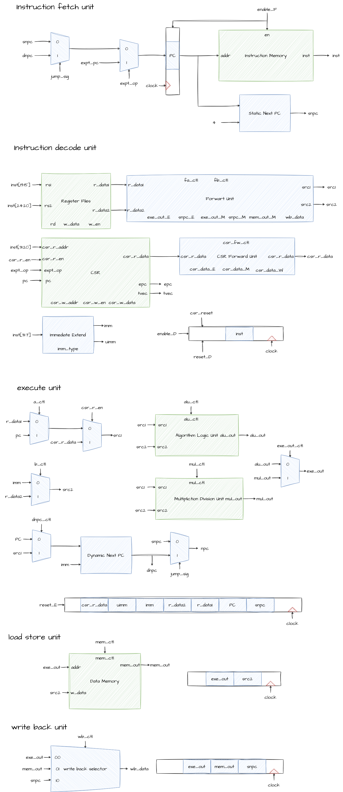

NPC
=======================

> New Process Core
>
> Writen by Chisel

`RISC-V`五级流水先处理器，预计将支持`RISCV64IMZicsr`指令集。

## 开始

首先，你需要根据 [此处](https://com-lihaoyi.github.io/mill)安装`mill`.

然后，按照 [此处](https://verilator.org/guide/latest/install.html)安装`verilator`.

测试整个设计：
```bash
make test
```

生成`verilog`代码：
```bash
make verilog
```

在`verilator`上面仿真：

```bash
make sim
```

查看`verilator`仿真时产生的波形文件：

**首先需要安装`gtkwave`**。对于`Ubuntu`，你可以通过`sudo apt install gtkwave`来安装。

```bash
make mv
```

清理项目中的编译中间文件：

```bash
make clean
```

## 工作目录

```
.
|- docs // 该目录下存放了一些文档
|- utils // 一些辅助工具
|- playgroud
	|- src // NPC的硬件描述核心代码部分
	|_ test // NPC的测试代码
|- verilator
	|- include // 仿真器的头文件
	|- script // 仿真器的编译脚本
	|- src // 仿真器的源代码
	|_ tools // 仿真器的辅助工具
|- build.sc // scala环境配置文件
|- README.md
|_ Makefile
```

## 详细设计

### 微架构设计图



在整个微架构设计当中，整个设计分为三个层面：数据通路层面，控制层面以及冒险层面。

- 数据通路层面：表示着正常数据流通过情况。

- 控制层面：根据指令生成控制信号，控制相应的逻辑单元的运算结果。

- 冒险层面：通过冒泡，转发，暂停等手段，防止流水线发生结构冒险，数据冒险和控制冒险。

  > 冒泡：例如在跳转指令时，因为需要三个周期（取指，译码，执行）才能判断出下一跳指令的地址，所以存在可能执行了两条不应该执行的指令。这个时候，通过重置这些阶段的寄存器以达到插入一条`NOP`指令的效果。该做法就称之为冒泡。
  >
  > 转发：将一条指令分为了5个阶段执行，会存在一种情况是，下一条指令需要用到上一条指令运行的结果。然而，一条指令只会在第五个阶段更新这条结果，这就导致了下一条指令无法及时的得到这个新数据。为了解决这个问题，我们可以将执行和访存这两个阶段的数据进行转发，发送到译码阶段，由译码阶段决定选择什么数据。这样的做法称之为转发。
  >
  > 暂停：实际上，访存操作一周期并不能完成操作，需要多个周期才可以完成。这个时候，我们不能让流水线继续流下去，应当保持在这个状态，所以需要暂停。
  >
  > **冒泡和暂停的区别**：
  >
  > 这两个概念一直困惑着我，尝试用下面这个图解释，图片取之于《深入理解计算机系统》。**第2行的暂停应该是1，第3行的图片下标应该是c，可能笔者误写**
  >
  > 
  
  结构冒险，该设计本身就避免了结构冒险。
  
  数据冒险部分使用转发来实现。我们保存了每个阶段的`rd`信息，所以我们直接通过比较译码阶段的两个源数据的地址是否与在执行阶段或者是访存阶段甚至是写回阶段的`rd`冲突。可能的冲突情况如下：
  
  
  
  若冲突，则选择合适阶段的转发值。具体的转发选择如下：
  
  ```
  fw_a = [
  	default: r_data1
  	rs1 == rd_E: [
  		wb_ctl_E == WB_CTL_ALU: alu_out_E
  		wb_ctl_E == WB_CTL_MEM: reset E, disable F,D
  		wb_ctl_E == WB_CTL_SNPC: snpc_E
  	]
  	rs1 == rd_M: [
  		wb_ctl_M == WB_CTL_ALU: alu_out_M
  		wb_ctl_M == WB_CTL_MEM: mem_out_M
  		wb_ctl_M == WB_CTL_SNPC: snpc_M
  	]
  	rs1 == rd_W: wb_data
  ]
  fw_b = [
  	default: r_data2
  	rs2 == rd_E: [
  		wb_ctl_E == WB_CTL_ALU: alu_out_E
  		wb_ctl_E == WB_CTL_MEM: reset E, disable F,D
  		wb_ctl_E == WB_CTL_SNPC: snpc_E
  	]
  	rs1 == rd_M: [
  		wb_ctl_M == WB_CTL_ALU: alu_out_M
  		wb_ctl_M == WB_CTL_MEM: mem_out_M
  		wb_ctl_M == WB_CTL_SNPC: snpc_M
  	]
  	rs1 == rd_W: wb_data
  ]
  ```
  
  控制冒险，即无条件跳转和分支跳转指令的下一条指令的地址判断冒险。我们采取先继续执行，待跳转结果得出之后，再考虑是否冲刷执行过的指令。冲刷方法是重置相应阶段的寄存器。重置控制如下：
  
  ```
  enable_F = (wb_ctl_E != WB_CTL_MEM) || (rs1 != rd_E && rs2 != rd_E)
  enable_D = (wb_ctl_E != WB_CTL_MEM) || (rs1 != rd_E && rs2 != rd_E)
  reset_D = jump_sig == true.B
  reset_E = (jump_sig == true.B) || (wb_ctl_E != WB_CTL_MEM) || (rs1 != rd_E && rs2 != rd_E)
  ```

### 控制信号

[控制信号文档](./docs/控制信号.md)，在该文档中详细介绍了各个信号的具体设计含义以及它们的作用。

### 控制信号表

[控制信号表](./docs/控制信号表.csv)，目前暂时记录了每个指令具体产生的信号。

在`utils/decodegen`目录下，已经编写好了`main.py`的`python`程序，该程序会将表格中的内容生成对应的`chisel`代码。使用时无需安装其他库。使用方法如下：（**请提前安装好`xclip`工具**）

```shell
python3 utils/decodegen/main.py | xclip -sel c
```

此时，会将生成的代码复制到剪切板中。然后将代码复制到`playground/src/control/DecodeTable.scala`中的`decode_map`的数组中。之后，在工程目录下运行`make reformat`会格式化代码。

## 测试

[测试大纲](./docs/测试大纲.md)，记录了测试说明，测试用例和实际的测试结果。
